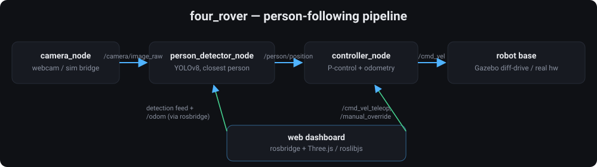
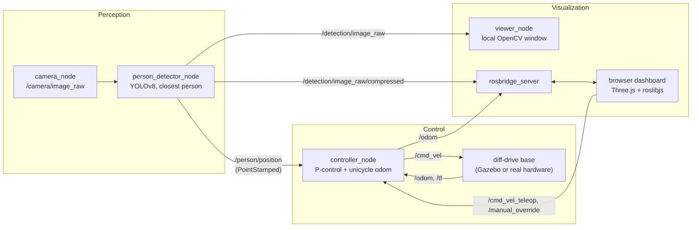

# four_rover — a person-following robot on ROS2 Jazzy


A four-wheel rover, simulated in Gazebo, that detects the nearest person with
YOLOv8 and follows them using a proportional distance/bearing controller —
with a live browser dashboard (Three.js + rosbridge) for monitoring and
manual override.

## Demo

<!--
Add these under docs/images/ (see docs/images/README.md for exactly what to
capture) and uncomment:

| Gazebo sim | Detection feed |
|---|---|
|  |  |

| Web dashboard | RViz |
|---|---|
|  |  |
-->

*Screenshots pending — see [`docs/images/README.md`](docs/images/README.md)
for what to capture once you run it locally.*

## Highlights

- **Perception**: YOLOv8 person detection, closest-target selection by
  bounding-box area, monocular distance/bearing estimation calibrated live
  from `/camera/camera_info` instead of a hardcoded guess.
- **Control**: proportional distance/bearing controller that turns to face
  the person before driving toward them (heading-gated forward speed), with
  an active sweep-scan search behavior instead of just stopping when
  tracking is lost.
- **Full-stack extension**: a rosbridge + Three.js/roslibjs browser
  dashboard for live 3D pose, camera streaming, and manual drive override —
  added without touching any perception code, because every node talks
  through typed ROS topics.
- **Simulation engineering**: the Gazebo world's walking-actor path is
  derived from actual room/robot/camera geometry (wall clearance, FOV,
  speed vs. the rover's max velocity) rather than picked by eye.
- **Debugging depth**: found and fixed a topic-name mismatch, a launch-file
  syntax bug, an inference-backlog latency bug, and a coordinate-sign
  inversion in the control loop — see [Debugging notes](#debugging-notes).



## Pipeline



Camera and detector are decoupled from control by a single typed message
(`geometry_msgs/PointStamped`, forward distance + lateral offset) — the
detector never has to know how the robot drives, and the controller never has
to know how the person was found. That interface is also what made it easy to
add the web dashboard on top without touching perception code: rosbridge just
subscribes to the same topics everything else does.

## Stack

ROS2 Jazzy · Python (`rclpy`) · OpenCV · YOLOv8 (`ultralytics`) ·
`ros_gz` (Gazebo) · `rosbridge_server` · Three.js · roslibjs

## Packages

| Package | Contents |
|---|---|
| `four_wheel_description` | Robot URDF/xacro (base, wheels, camera, lidar), RViz config |
| `four_worlds` | Gazebo worlds (`follower_world.world` includes a walking-actor target) |
| `four_control` | `camera_node`, `person_detector_node`, `controller_node`, `viewer_node` |
| `four_control_bringup` | Gazebo bringup + combined "one command" launch |
| `four_web_dashboard` | rosbridge + static Three.js/roslibjs browser dashboard |

## Nodes & topics

| Node | Subscribes | Publishes |
|---|---|---|
| `camera_node` | — | `/camera/image_raw` |
| `person_detector_node` | `/camera/image_raw` | `/person/position` (`PointStamped`), `/detection/image_raw`, `/detection/image_raw/compressed`, `/person_detected` |
| `controller_node` | `/person/position`, `/cmd_vel_teleop`, `/manual_override` | `/cmd_vel`, `/odom` + `odom→base_link` tf (optional) |
| `viewer_node` | `/detection/image_raw` | — |

`controller_node` runs a fixed-rate loop: if manual override is active and a
teleop command is fresh, it forwards that; else if a person detection is
fresh, it applies proportional control on distance and bearing — forward
speed is gated by `cos(bearing)`, so a large heading error is corrected by
turning in place first rather than driving forward on a diagonal while also
turning; otherwise it **sweep-scans** — rotates in place the way the person
was last seen drifting, reversing direction every
`search_reverse_interval_sec` if that doesn't reacquire them, rather than
just freezing. Odometry publishing (`publish_odom`) is a parameter — it's
off in the Gazebo bringup because `gz-sim-diff-drive-system` already
provides real odometry from physics, and on by default for
standalone/real-hardware runs where nothing else produces it.

`person_detector_node` subscribes to the camera with a queue depth of 1 and
runs YOLO at a reduced `inference_size` (384px, param-configurable) so it
always processes the newest available frame instead of falling behind and
working through a backlog — with a deep queue, a CPU too slow for real-time
inference ends up reacting to frames that are already several positions
stale, which looks exactly like "not really following."

Distance is estimated monocularly from bounding-box height via similar
triangles (`person_height_m`, `focal_length_px` params) — a deliberate
approximation, not a substitute for depth/stereo; see
[Limitations](#limitations--next-steps).
`person_detector_node` overrides `focal_length_px` with the real focal
length from `/camera/camera_info` as soon as it arrives (Gazebo publishes
this via the bridge), so the sim uses the camera's true intrinsics rather
than the generic webcam default.

## Running it

Build the workspace:

```bash
colcon build
source install/setup.bash
```

**Full simulation** — Gazebo, perception/control (wired to the sim camera
and diff-drive base), and the web dashboard, in one command:

```bash
ros2 launch four_control_bringup follower_sim.launch.py
```

Then open `http://localhost:8000` for the dashboard (3D pose, live detection
feed, manual drive with an override toggle).

**Standalone perception** (real webcam, no simulator):

```bash
ros2 launch four_control perception.launch.py
```

**Web dashboard only** (against whatever perception/control is already
running):

```bash
ros2 launch four_web_dashboard web.launch.py
```

## Debugging notes

Roughly in the order they surfaced while getting this working end-to-end:

1. **Topic mismatch** — the original camera node published to `/image_raw`
   while the detector subscribed to `/camera/image_raw`; they never talked
   to each other. Unified on one topic name used by both the real webcam
   path and the Gazebo-bridged sim path.
2. **Broken launch file** — `LaunchDescription[{detector,}]` (subscript with
   a set literal, not a call) threw at runtime. Rebuilt as
   `perception.launch.py` with proper `LaunchDescription([...])` and
   declared launch arguments.
3. **GUI blocking the executor** — `cv2.imshow` was called directly inside
   the detector's subscriber callback, which breaks headless/real-robot
   operation. Split display into its own `viewer_node`.
4. **Distance bias** — a hardcoded focal length didn't match the simulated
   camera's actual FOV, inflating every distance estimate by ~38% and
   making the controller misjudge how far to drive. Fixed by reading the
   real focal length from `/camera/camera_info`.
5. **Chasing a ghost** — a deep image-subscription queue let YOLO fall
   behind the camera's frame rate on CPU, so the controller kept reacting to
   frames from several positions ago. Fixed with a queue depth of 1 (always
   process the newest frame) plus a smaller inference resolution.
6. **Inverted steering** — the robot turned away from the person instead of
   toward them. The lateral-offset-to-`PointStamped.y` sign didn't match
   the actual image-to-world convention in practice; flipped it and
   verified against live `/person/position` and `/cmd_vel` values.

## Limitations / next steps

- Monocular distance estimate assumes a fixed average person height; the
  focal length comes from `/camera/camera_info` when available and a
  hand-tuned default otherwise — still no real depth sensing.
- The sim actor (`follower_world.world`) walks a fixed ~4.5m-radius loop at
  roughly 0.45 m/s, deliberately kept under the rover's default
  `max_linear_vel` (0.6 m/s) so the controller can actually close the gap
  and hold `target_distance` instead of perpetually trailing at full speed.
- No re-identification: if two people cross paths, the tracked target is
  whoever currently has the largest bounding box, not necessarily the same
  individual as a frame ago.
- **Interfacing with real hardware** is the next step — the topic-level
  design (unified `/camera/image_raw`, standalone `publish_odom`) already
  targets this so the same nodes should run against real hardware with only
  a driver/camera swap.
